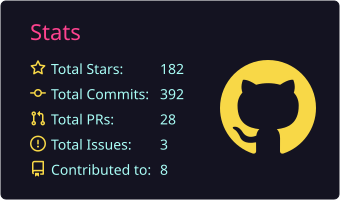
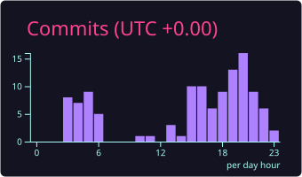
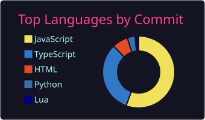

# Hey there, I'm Raul! 👋
  

I build **stupid things** — but like, _on purpose_.  
Welcome to my corner of the internet where I make projects for myself, and occasionally, for the internet to judge (gently, I hope).

## 🧠 Who am I?

I’m just a developer from **Romania** who loves building cool, unnecessary, and sometimes actually useful things.  
Mostly into **frontend** and visual stuff — if it looks nice and does something fun, I probably made it or broke it trying.

---

## 🛠 Greatest Hits

### 📲 [**HA WhatsApp Bridge**](https://github.com/raulpetruta/ha-wa-bridge)   
A bridge to integrate WhatsApp with Home Assistant for sending messages and run automations based on received messages.  
`Home Assistant` | `WhatsApp` | `Puppeteer` | `Docker`

### 🧺 [**Samsung Washer Card**](https://github.com/raulpetruta/samsung-ha-washer-card)   
A beautiful, animated Home Assistant card for Samsung washing machines with SmartThings integration.  
`Home Assistant` | `SmartThings` | `Lovelace` | `Samsung Washing Machine`

### 🎙️ [**Voice Calibration Plugin**](https://github.com/raulpetruta/voice-calibration-plugin)   
A voice plugin that teaches AI to write more like you.

`AI` | `Voice` | `Writing`

---

## 📊 GitHub Stats (proof I actually code sometimes)

  <picture>
    <source media="(prefers-color-scheme: dark)" srcset="https://raw.githubusercontent.com/raulpetruta/raulpetruta/output/github-snake-dark.svg" />
    
  </picture>

  
  

  

<i>💛 JavaScript: the language I love to hate and hate to love. But let's be honest, we all know  Claude does all the work.</i>

---

## 🧃 Wanna Be Internet Friends?

Feel free to explore my repos, clone them, break them, fix them (pls), or just drop a ⭐ to fuel my ego.

---

## ☕ Support My Stupidity

If you like what I do and want to help me keep doing it, or just buy me a coffee(I prefer protein shakes tbh), no pressure:

- [Buy Me a Coffee](https://buymeacoffee.com/raulpetruta)
- [PayPal](https://paypal.me/raulpetruta98)

Thanks for fueling my chaotic creative energy 🧃
